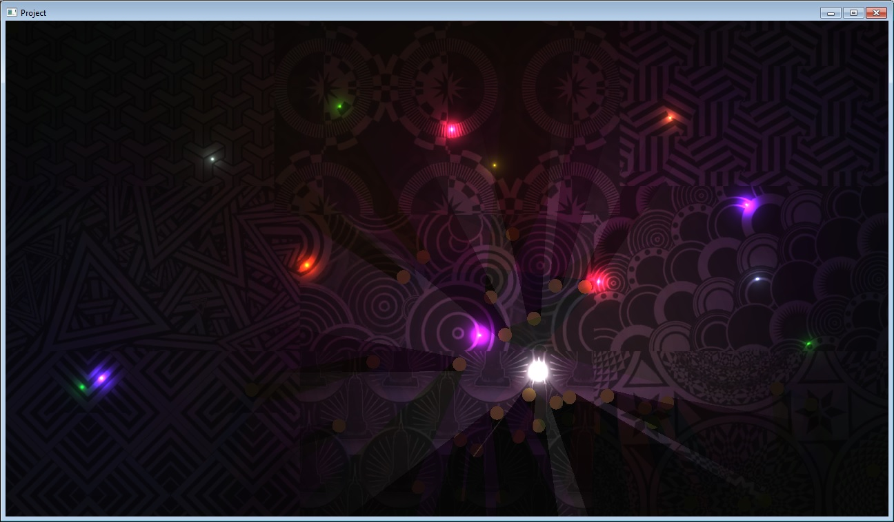

# SFBL
SFML Box2D Light
is a very simple library and easy-to-use, this library allows you to add cool lighting effects including shadow casting etc...
Current Features:
========
- Spotlight
- Conelight
- Pointlight
- Able to change the darkness of scene

Binaries:
========
MinGW 4.9.2 static binaries have been already generated

